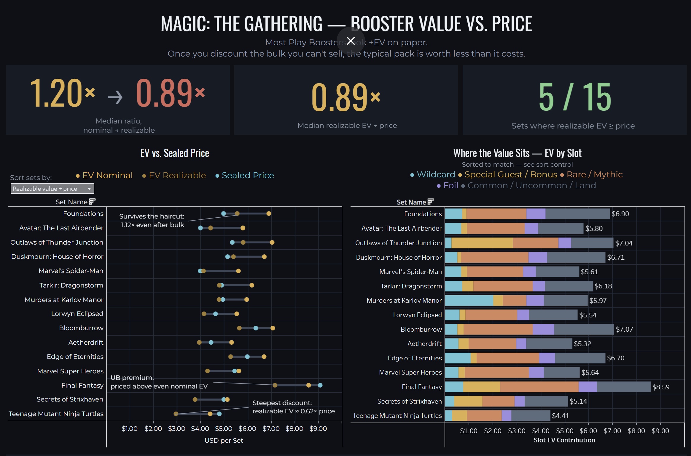

# MTG Commercial Analytics

Pricing analytics for *Magic: The Gathering* sealed product, built entirely on
public data. Computes booster expected value (EV) from real collation
configurations, compares it against street prices, and separates paper value
from value you can actually extract.

**Live dashboard:** [Tableau Public — MTG: Booster Value vs. Price](https://public.tableau.com/app/profile/obie.w.lawrence/viz/MTGCommercialAnalytics/BoosterValue)



---

## The question

Wizards of the Coast prices sealed *Magic* product against a secondary market
it doesn't control. This project asks: **is a Play Booster worth what it
costs?** — and shows that the answer depends entirely on how honestly you
count.

## Headline findings

- **On paper, most packs beat their price. In practice, most don't.**
  13 of 15 Play-Booster-era sets have nominal singles EV above their sealed
  price (median ratio 1.20×). After applying a bulk floor — discounting cards
  that can't actually be liquidated — only 5 of 15 remain above price
  (median 0.89×).
- **The bulk haircut is a constant, not a variable.** Every Play Booster
  carries $1.17–$1.48 of unsellable singles (median $1.37, ~22% of nominal
  EV). The nominal-to-realizable flip happens because most sets' nominal
  margin was thinner than that fixed haircut.
- **Licensed sets are priced above their content.** Universes Beyond packs
  return a median 0.79× realizable value vs. 0.93× for in-universe sets.
  Final Fantasy is the clearest case: the highest nominal EV of any set
  ($8.59) and the only pack priced above it ($9.08).
- **Sealed pricing tracks brand more than content.** Pack prices span
  $3.99–$9.08 while nominal EV spans only $4.41–$8.59 (correlation 0.78).
  Price is set by demand and licensing, not by what's in the pack.

## Data sources

| Source | Content | Fetch |
|---|---|---|
| [MTGJSON](https://mtgjson.com/) `AllPrintings` | Card attributes and per-set booster collation configs (print sheets, slot weights) | `src/fetch_card_data.py` |
| [MTGJSON](https://mtgjson.com/) `AllPrices` / `AllPricesToday` | Daily card prices (rolling ~90-day history + accumulated daily snapshots) | `src/fetch_price_snapshot.py`, run daily |
| TCGplayer | Sealed Play Booster market prices | Hand-collected 2026-07-10, documented in `data/sealed_prices.csv` schema |

Raw pulls are not committed; see `data/README.md` for exact fetch commands.

## Pipeline

```
fetch_card_data.py        MTGJSON AllPrintings -> data/AllPrintings.json.gz
fetch_price_snapshot.py   daily price snapshot -> data/snapshots/ (idempotent)
parse_prices.py           price JSON -> tidy parquet (streaming, ijson)
compute_booster_ev.py     collation configs x prices -> booster_ev.csv (+ by-slot)
build_ev_price_source.py  EV + sealed prices -> ev_vs_price.csv, ev_by_slot.csv
```

The Tableau workbook (`tableau/`) connects to the two output CSVs via relative
paths, so a cloned repo opens without repointing.

## Method

- **Booster EV** is computed from MTGJSON's community-maintained collation
  configs: for each booster configuration (weighted), sum over sheet slots of
  picks × the sheet's **weight-averaged** latest TCGplayer market price.
  Sheet weights matter — a naive average would overstate EV by treating a
  rare mythic as equally likely as a common on the same print sheet.
- **Finish-aware pricing:** foil sheets are priced against foil prices,
  normal sheets against nonfoil.
- **Realizable EV** applies a bulk floor: cards under $0.25 are valued at
  $0.02, reflecting that bulk commons cannot be liquidated at listed market
  price (fees, shipping, and bulk-lot rates make their net value ≈ 0). Both
  thresholds are CLI-tunable and recorded in the output.
- **Coverage accounting:** cards on a sheet with no observed price contribute
  zero but are tracked as `unpriced_weight_share`, never silently imputed.
  All 15 in-scope play variants have 100% price coverage.
- **Cross-checks:** per-set slot contributions reconcile exactly to total EV;
  the EV/sealed join asserts full set-code matching and fails loudly on any
  mismatch.

## Scope

Play Booster era only — Murders at Karlov Manor (Feb 2024) onward, 15 premier
sets. Earlier draft/set-booster products are structurally different packs and
are excluded rather than pooled. Universes Beyond (licensed) sets are flagged
with a `set_category` column for separate comparison.

## Limitations

- Secondary-market proxy: singles prices are not Wizards of the Coast
  internal cost, margin, or sales data, and no claims are made about actual
  margins or unit sales.
- Collation configs are community-maintained and may deviate from official
  print sheets.
- Sealed prices are a single-date snapshot (2026-07-10); EV reflects singles
  prices as of that date. n = 15 sets (5 Universes Beyond) — findings are
  descriptive of this snapshot, not inferential claims.
- The bulk floor ($0.25 → $0.02) is an assumption; it is disclosed, recorded
  in the outputs, and tunable for sensitivity analysis.

## Reproducing

```
pip install -r requirements.txt
cp .env.example .env                      # fill in contact email
python src/fetch_card_data.py
python src/fetch_price_snapshot.py        # repeat daily to accumulate history
python src/parse_prices.py
python src/compute_booster_ev.py --verbose
python src/build_ev_price_source.py
```

Sealed prices are hand-collected (schema in `data/README.md`); the dashboard
consumes `data/processed/ev_vs_price.csv` and `ev_by_slot.csv`.

## Repository layout

```
src/        pipeline scripts (fetch, parse, EV engine, join)
sql/        (reserved)
data/       gitignored; data/README.md documents fetches
tableau/    MTG Commercial Analytics.twb (relative connections, scrubbed)
docs/       dashboard screenshot
```

## Author

Obie W. Lawrence · [github.com/obi-law](https://github.com/obi-law) ·
[Tableau Public](https://public.tableau.com/app/profile/obie.w.lawrence)